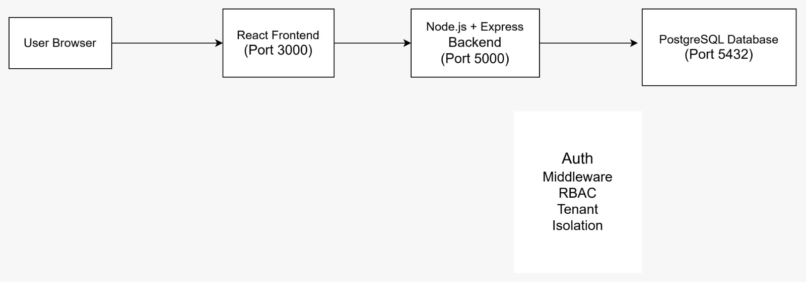

# System Architecture Document

## 1. High-Level System Architecture

The system follows a multi-tier architecture designed for scalability, security, and maintainability. The architecture consists of a client layer, frontend application, backend API server, authentication mechanism, and database.

### Architecture Components

- **Client (Browser):**  
  Users access the system through a web browser.

- **Frontend Application:**  
  A React-based single-page application (SPA) responsible for user interaction, UI rendering, and API communication.

- **Backend API Server:**  
  A Node.js and Express-based REST API that handles business logic, authentication, authorization, and tenant isolation.

- **Authentication Flow:**  
  JWT-based authentication is used. After login, the frontend includes the JWT token in API requests. The backend validates the token and extracts user role and tenant context.

- **Database:**  
  PostgreSQL database using a shared schema multi-tenant model with tenant_id based isolation.

### System Architecture Diagram

---

## 2. Database Schema Design

The database is designed using a shared schema multi-tenancy approach. All tenant-specific tables include a `tenant_id` column to ensure strict data isolation.

### Core Tables

- **Tenants:** Stores organization-level information.
- **Users:** Stores user details and roles within a tenant.
- **Projects:** Represents projects created under a tenant.
- **Tasks:** Represents tasks associated with projects.

### Tenant Isolation Strategy

The `tenant_id` column is present in all tenant-owned tables. Backend middleware ensures every query is scoped using the tenant_id extracted from the authenticated JWT token.

### Entity Relationship Diagram (ERD)

---

## 3. API Architecture

The backend exposes RESTful APIs organized by functional modules. All protected endpoints require authentication using JWT tokens. Certain endpoints also require specific user roles.

### Authentication APIs
| Endpoint | Method | Auth Required | Role |
|--------|--------|---------------|------|
| /auth/register | POST | No | Public |
| /auth/login | POST | No | Public |
| /auth/logout | POST | Yes | Any |

### Tenant APIs
| Endpoint | Method | Auth Required | Role |
|--------|--------|---------------|------|
| /tenants/create | POST | Yes | Super Admin |
| /tenants/list | GET | Yes | Super Admin |

### User APIs
| Endpoint | Method | Auth Required | Role |
|--------|--------|---------------|------|
| /users/invite | POST | Yes | Tenant Admin |
| /users/list | GET | Yes | Tenant Admin |

### Project APIs
| Endpoint | Method | Auth Required | Role |
|--------|--------|---------------|------|
| /projects/create | POST | Yes | Tenant Admin |
| /projects/list | GET | Yes | User |

### Task APIs
| Endpoint | Method | Auth Required | Role |
|--------|--------|---------------|------|
| /tasks/create | POST | Yes | User |
| /tasks/update | PUT | Yes | User |
| /tasks/delete | DELETE | Yes | Tenant Admin |
